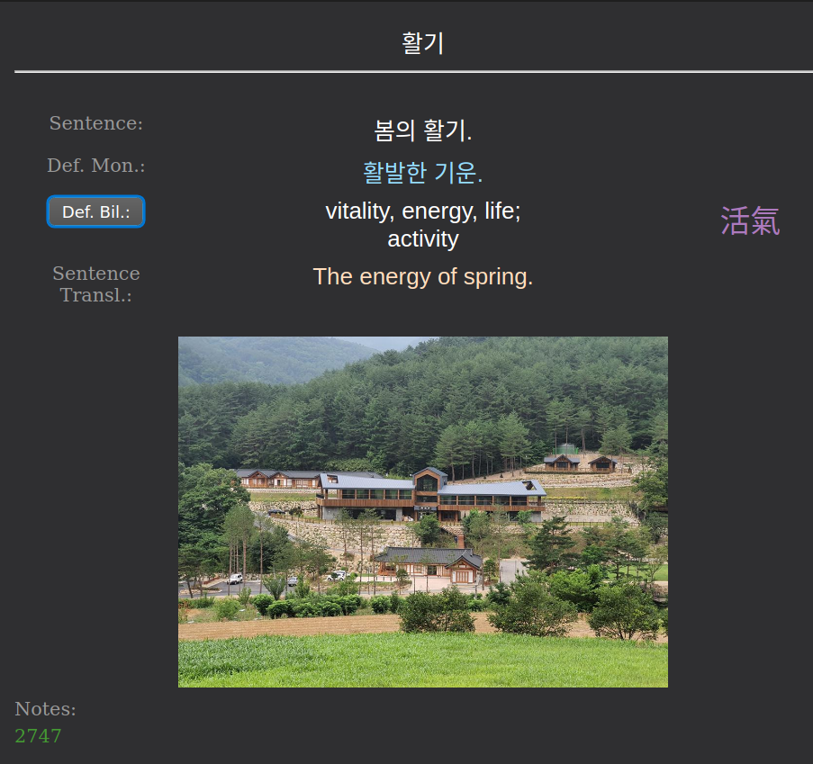

# Anki language learning template

### Features

- Show initially hidden bilingual definitions on button click
- Colorful
- Switch sentence card to vocab card by removing content of the "Word" field
- Compatible with ASBPlayer sentence mining workflow

### Compatible with fields
- Sentence
- Definition Bilingual
- Definition Monolingual
- Sentence Translation
- Word
- Word Audio
- Sentence Audio
- Image
- Notes
- Source
- URL
